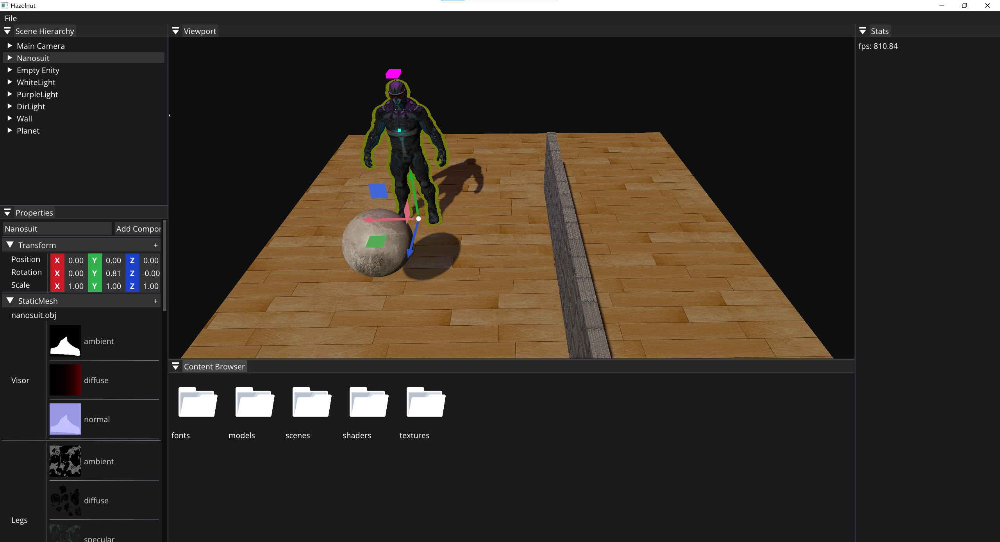

# Hazel
基于OpenGL的渲染编辑器

## 用户指南

### 面板

- **Scene Hierarchy**：右键空白部分选择添加对象，左键选中物体后右键选择删除对象
- **Properties**：可编辑对象名称，右上方按钮添加组件，每个组件区域右上方删除组件。可编辑每个组件的属性，以及拖拽Content Browser中的模型文件和纹理文件到StaticMesh组件中
- **ViewPort**：显示场景，选中场景视口后，WSAD前后左右移动摄像机，鼠标右键滑动旋转摄像机。点击场景中对象，选中的对象会边缘高亮，并通过WER召唤控件进行平移旋转缩放
- **Content Browser**：树形层次文件目录结构，显示引擎资产文件

## 特性

- 基于ECS的场景对象管理，序列化，反序列化
- OpenGL API抽象封装
- 3D场景渲染：Blinn Phong着色、阴影映射、定向光、点光源

